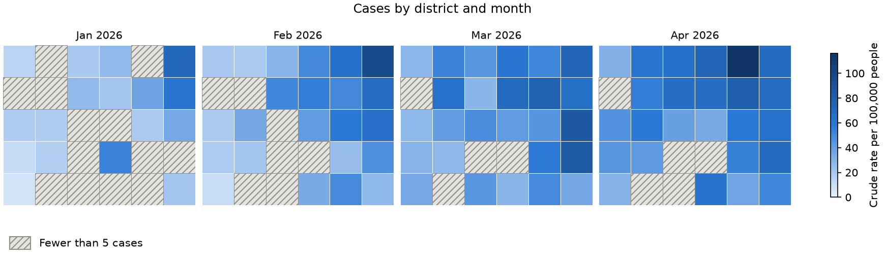

# Getting started

## Install

```bash
pip install epiplot
```

For rate maps, which need GeoPandas, install the extra map libraries too:

```bash
pip install "epiplot[maps]"
```

**epiplot** needs Python 3.13 or newer. It works in Google Colab, which already
includes GeoPandas.

## Epidemic curves

An epidemic curve shows the number of cases in each day, week or month.
Start with a table that has one row per case (a "line list"):

```python
import pandas as pd

import epiplot

cases = pd.DataFrame(
    {
        "onset_date": ["2026-03-02", "2026-03-04", "2026-03-10", "2026-03-11", None],
        "origin": ["Local", "Travel", "Local", "Local", "Travel"],
    }
)

ax = epiplot.epicurve(cases, "onset_date", date_type="onset", group_col="origin")
ax.figure.savefig("epicurve.png")
```

Always give `date_type`, so readers know what the dates mean. For the
counts behind the plot, use {func}`epiplot.count_cases`.

## Rate maps

A rate map shades each region by its rate per population. You need a
GeoPandas table of region shapes, and a table with one row per region:

```python
ax = epiplot.rate_map(
    regions, data, "area_code", cases_col="cases", population_col="population"
)
```

For one small map per period, all sharing one colour scale, use
{func}`epiplot.rate_map_timeline`:



For the rates behind the maps, with exact 95% confidence intervals, use
{func}`epiplot.calculate_rates`.

## Survival curves

```python
ax = epiplot.survival_curve(
    trial, "weeks", "relapsed", time_unit="weeks", group_col="treatment"
)
```

`trial` has one row per person: a follow-up time, and whether the event
happened (1) or the person was censored (0). For the estimates behind the
plot, as a table, use {func}`epiplot.kaplan_meier`.

## More examples

Complete, runnable examples are in the
[examples folder on GitHub](https://github.com/leehart3000/epiplot/tree/main/examples).
