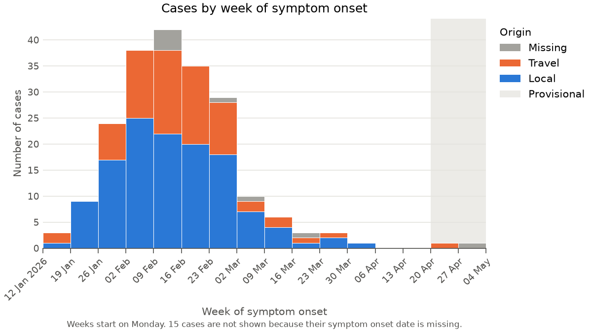

# epiplot

Plots for epidemiology and public health research, with good practice
built in.



epiplot makes standard epidemiological plots easy, and hard to get wrong.
Each plot has sensible defaults based on good practice: clear labels,
honest handling of missing data, and colours that work for colour-blind
readers.

Ready to try:

- **Epidemic curves:** cases over time.
- **Rate maps:** rates by region, for one period or as a timeline.

epiplot is in early development (alpha), so details may still change.

```{toctree}
:maxdepth: 2

getting-started
how-it-works
api
```
